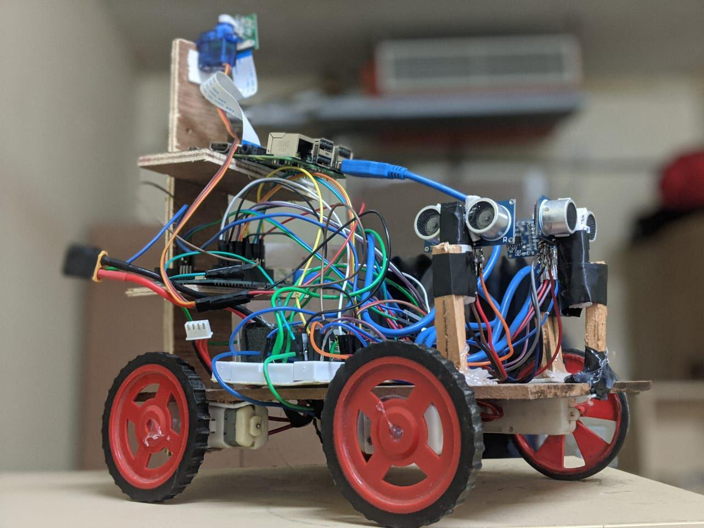
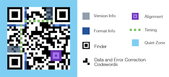
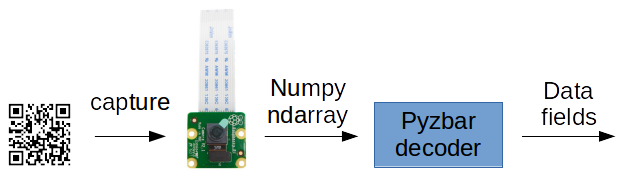
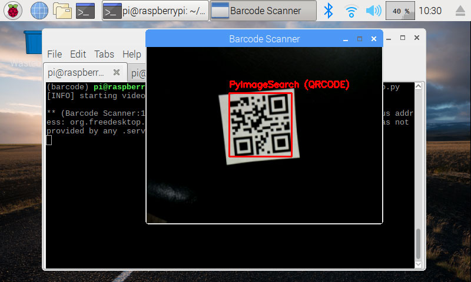

# Auton

<p align="center">
  
</p>

<p align="center">

</p>

- A self driving bot made using Raspberry Pi, OpenCV and UNO used in real-time video streaming detection and text recognition for barcodes and QR codes.
> Working prototype of this project is [*here*](https://vimeo.com/384221710?utm_source=email&utm_medium=vimeo-cliptranscode-201504&utm_campaign=28749)

[](https://github.com/codekhal/autonomous-bot/issues)
[](https://github.com/codekhal/autonomous-bot/network/members)
[](https://github.com/codekhal/autonomous-bot/stargazers)


  
  


## :ledger: Index

- [Index](#index)
- [About](#about)
- [Usage](#usage)
- [Commands](#commands)
  - [Installation](#installation)
- [File Structure](#file-structure)
- [Brief Description and Proposed Solution](#brief-description-and-proposed-solution)
- [Info Gallery](#gallery)
- [Guidelines](#guideline)
- [Resources](#resources)
- [Present Contributors](#contributors)
- [License](#license)

## :beginner: About

> Intelligent Office: a Luxury or a Necessity?

Most people still refuse to engage in IoT in the workplace, although some of them have mixed feelings about them that have tried different products.
Whether or not to implement these solutions in your office is ones call. But let's keep in mind that a powerful competitive advantage over the competition can become even the slightest increase in one's business efficiency.
And not to mention the fact that a comfortable office environment can help you attract and
retain the best talent.
As you can see, the benefits of IoT in an office are obvious.
<br>

<p> Therefore made an autonomous bot for real-time detection and text recognition in barcodes and QR codes for video streaming . 
Specific barcodes are assigned to different office employees, now we will scan the barcode it and will return the required data of
the person (in our project the specific data is the name of the person and its basic details).
<br>
In our project, we are using a combination of Internet Of Things (IoT) and Python smart libraries. 
</p>
<br>

## :zap: Usage

We shall add-on these technologies to:
- Increase productivity
- Streamline daily routine tasks 
<br>
Make a comfortable environment for employees for their better performance

## :electric_plug: Installation

### :package: Commands

#### Packages which should be imported:
- **pyzbar**: Python wrapper for zbar library. 
- **imutils**:​ A series of convenience functions to make basic image processing functions such as
translation, rotation and resizing much easier with OpenCV and python.
- **argparse**: ​ It is included with the Python install and it is responsible for parsing command-line
arguments.
- **VideoStream**: Used to handle capturing video frames in an efficient and threaded approach. This class
will call either ​ WebcamVideoStream​ or ​ PiVideoStream​ based on the arguments supplied to the
constructor.

Just want to run the application, what you can do is:
<br>
Make sure to install OpenCV correctly in your Raspberry Pi. You may refer [this](https://www.pyimagesearch.com/opencv-tutorials-resources-guides/) for further clarification. <br>

- For understanding the whole process throughly and to install all the required packages [here](https://www.pyimagesearch.com/2018/05/21/an-opencv-barcode-and-qr-code-scanner-with-zbar/) is the best guide. <br>

- Clone the repository

```bash
$ git clone https://github.com/codekhal/autonomous-bot.git 

```

- Install dependencies.

```bash
$ cd autonomous-bot
```

- Now in your terminal, run the application using 

```bash
$ python3 barcode_scanner.py
```  
Note: It is important you write **python3**, since all the packages are install for this version only. Mind you it will take lots of efforts to let everything run smooth and free of errors, like it took at my time. 

- Finally, place a QR Code in front of your WebCam or RaspiCam which ever you prefer. Hope you will get required result.

## :open_file_folder: File Structure

- File structure with the basic details about files and directories.

```bash
- __autonomous-bot__
├── bot.ide
├── _config.yml
├── images
│   ├── bot.jpg
│   ├── finaloutput.jpg
│   ├── fullWorking.jpeg
│   ├── image12.png
│   ├── image1.png
│   ├── image3.gif
│   ├── image7.png
│   ├── pyzbarDecoding.png
│   ├── qrcodeZones.png
│   └── workingModel.png
├── LICENSE
├── logo
│   ├── Auton.png
│   ├── favicon_io
│   │   ├── favicon-16x16.png
│   │   ├── favicon-32x32.png
│   │   └── favicon.ico
│   └── logo.png
├── main.py
└── README.md

3 directories, 20 files
```

## Brief Description of Proposed Solution

- An autonomous-bot made using Raspberry Pi, Arduino Uno, Raspi Cam and three ultrasonic sensors. We used Python, OpenCV, pyzbar to detect and recognise tect from QR codes or Barcodes. It uses a map made using Data Structure (Linkedlist,trees,graphs or even simple aray works) and after providing the source and destination. It also senses obstacles and people walking around and using its ultrasonic sensors reaches its defined location and finally a buzzer sound or LED light, either can be used to indicate arrival of bot to its destination. It is useful in transferring various items from one cabin to another and could act as a helping hand in an office environment.

### About Quick Response code or QR Codes:

<p align="center">

</p>

Note: OR Codes were developed to improve the reading speed of complex 2D barcodes.

- Pattern:​ Three big squares in the corners used for detecting the position, the size and the angle of the QR
code.
- Alignment Pattern:​ A pattern used for correcting the distortion of the QR code. These distortions could
occur for example when attaching the codes onto a curved surface.
- Timing Pattern:​ It consists of white and black modules arranged alternately and placed between two
position patterns. It is used to determine the central coordinate of each cell in the QR code.
- Quiet Zone:​ A margin space that makes easier to detect the QR code. At least four cells are required for
the quiet zone.
- Data Area​ : The area in the QR code that contains the data (for example a URL) encoded in binary
numbers.

## :camera: Info Gallery

<p align="center">
   <br>
  Pyzbar Decoding of our vedio frame <br><hr/><br>
</p>
<p align="center">
   <br>
  Final Working of our Model <br><hr/><br>
</p>
<p align="center">
   <br>
  Final Output <br><hr/><br>
</p>

- For underastanding the full use case of this project refer to [this](https://github.com/codekhal/autonomous-bot/blob/master/images/workingModel.png) full working diagram.

## :scroll: Guidelines

- __Contribution Guidelines__

**Future Work that could be done**:

- *Flask App Deployment/Android App* -​ ​ Deploy the app so that employees could use it
through their phone itself and it will provide convenience to daily basic needs.

- *Database* -​ We have to rely on inputs every time and databases are a remedy for that. We shall store
basis information of the respective faculties and finally help the bot to train well. Therefore one could plan to
implement a database for storing information for training purposes.

- *Use of Deep Learning* -​ One may try and use deep learning for learning the surroundings and object detection so that our
bot moves smoothly around the cabins and office without we proving some hard-coded commands. Deep Learning shall help us get more accurate and better performance.


Kindly follow the [*Contributions Guildlines*](https://gist.github.com/PurpleBooth/b24679402957c63ec426) before you create any pull requests or issues. Though feel free to contribute in any form. <br> Open Source <3

##  :page_facing_up: Resources

- [Full Working Model](https://github.com/codekhal/autonomous-bot/blob/master/images/workingModel.png)
- [Zbar library](http://zbar.sourceforge.net/)
- [Good read Article](https://www.pyimagesearch.com/2018/05/21/an-opencv-barcode-and-qr-code-scanner-with-zbar/)

## :star2: Present Contributors
[](https://github.com/codekhal/autonomous-bot/graphs/contributors)

### Want to share your ideas

`Feel free to reach out to me`

[](https://telegram.me/codekhal)

## :lock: License
[](https://github.com/codekhal/autonomous-bot/blob/master/LICENSE)
